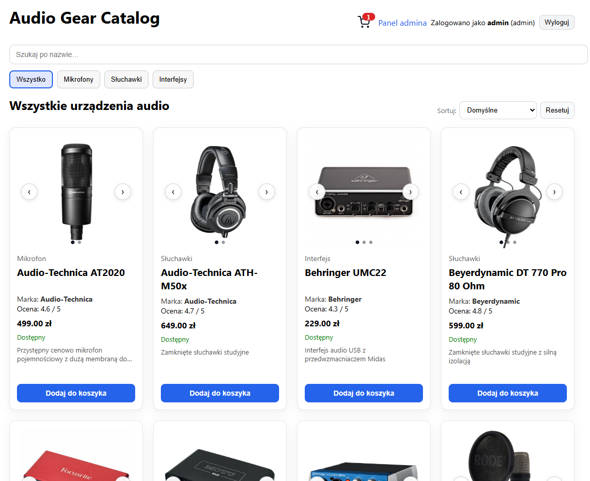
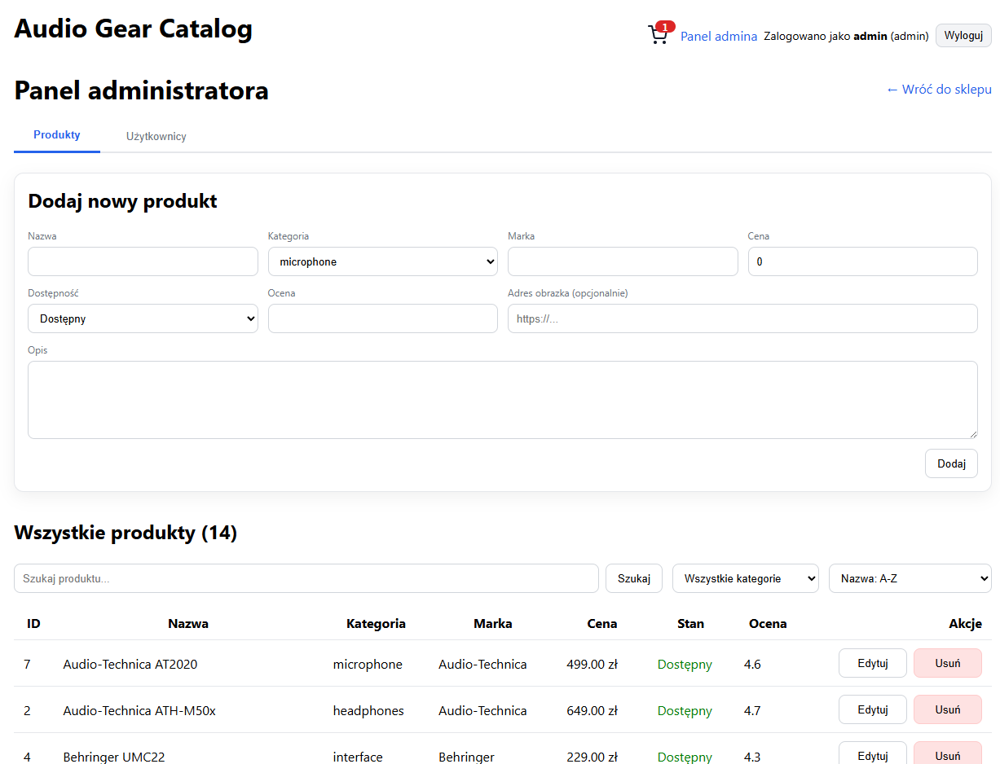
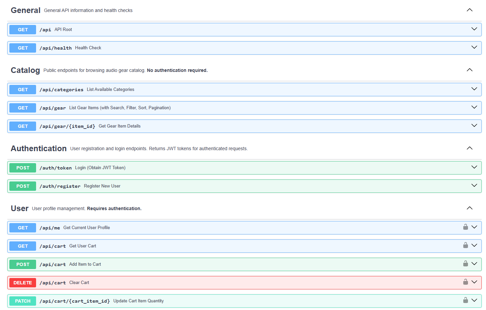
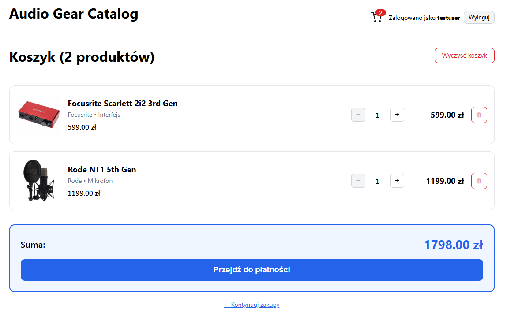

# Audio Gear Catalog

A web application for browsing and purchasing audio equipment - an online store. University project.



## Table of Contents

- [Architecture](#architecture)
- [Features](#features)
- [Technologies](#technologies)
- [Installation and Setup](#installation-and-setup)
- [Test Users](#test-users)
- [API Documentation](#api-documentation)
- [Screenshots](#screenshots)

## Architecture

The project consists of two main components:

### Backend (FastAPI + SQLAlchemy)
```
backend/
├── app/
│   ├── main.py           # Main application file, CORS configuration, DB initialization
│   ├── models.py         # ORM models (User, GearItem, CartItem)
│   ├── schemas.py        # Pydantic schemas for validation
│   ├── auth.py           # JWT authentication, login/registration
│   ├── db.py             # Database connection configuration
│   ├── docs.py           # Metadata for API documentation
│   └── routes/
│       ├── catalog.py    # Product catalog endpoints
│       ├── cart.py       # Cart management
│       └── admin.py      # Admin panel
└── requirements.txt
```

**Database**: SQLite (`app.db`) with automatic data seeding

**Authorization**: JWT tokens with bcrypt hashed passwords

**API**: RESTful with full OpenAPI/Swagger documentation

### Frontend (React + TypeScript + Vite)
```
frontend/
├── src/
│   ├── main.tsx          # Application entry point
│   ├── App.tsx           # Routing and main catalog view
│   ├── Header.tsx        # Navigation and user info
│   ├── Login.tsx         # Login form
│   ├── Register.tsx      # Registration form
│   ├── ProductDetail.tsx # Product details
│   ├── Cart.tsx          # Cart view
│   ├── AdminPanel.tsx    # Admin panel
│   ├── api.ts            # API communication functions
│   ├── cart.ts           # Cart state management
│   └── images.ts         # Product image mapping
├── attachments/          # Product images
└── package.json
```

**Styling**: Inline CSS with responsive design

**State**: React hooks (useState, useEffect) + localStorage for cart

## Features

### For all users:
- Browse audio equipment catalog with category filtering (microphones, headphones, interfaces)
- Search products by name
- Detailed product information (description, price, rating, availability, image gallery)
- Shopping cart with localStorage persistence

### For logged-in users:
- Registration and login with JWT authorization
- Order checkout (placing orders from cart products)
- Order history

### For administrators:
- Adding new products
- Editing existing products
- Deleting products
- User management (granting admin privileges)
- Viewing all user orders



## Technologies

### Backend:
- **FastAPI** 0.115.2 - modern web framework
- **SQLAlchemy** 2.0.36 - ORM for database management
- **Uvicorn** - ASGI server
- **python-jose** - JWT token handling
- **passlib[bcrypt]** - password hashing
- **SQLite** - database

### Frontend:
- **React** 18.3.1 - UI library
- **TypeScript** 5.5.4 - typed JavaScript
- **Vite** 5.4.8 - fast build tool
- **React Router** - routing (manually implemented)

## Installation and Setup

### Requirements:
- Python 3.11+
- Node.js 18+ and npm

### Backend

1. Navigate to the backend directory:
```bash
cd backend
```

2. Create a Python virtual environment:
```bash
python -m venv venv
```

3. Activate the environment:
- **Windows:**
  ```bash
  venv\Scripts\activate
  ```
- **Linux/Mac:**
  ```bash
  source venv/bin/activate
  ```

4. Install dependencies:
```bash
pip install -r requirements.txt
```

5. Start the server (from the main project directory):
```bash
uvicorn backend.app.main:app --reload --host 0.0.0.0 --port 8000
```

Backend will be available at: `http://localhost:8000`

API Documentation (Swagger): `http://localhost:8000/docs`

### Frontend

1. Navigate to the frontend directory:
```bash
cd frontend
```

2. Install dependencies:
```bash
npm install
```

3. Start the development server:
```bash
npm run dev
```

Frontend will be available at: `http://localhost:5173`

### Production Build

To build the production version of the frontend:
```bash
cd frontend
npm run build
```

The built application will be in the `frontend/dist` folder and will be automatically served by the FastAPI backend.

## Test Users

After the first run, the backend automatically creates an administrator account and several test users:

### Administrator:
- **Username:** `admin`
- **Password:** `admin`

### Test Users:
- **user1** / `password1`
- **user2** / `password2`
- **testuser** / `test123`
- **jankowalski** / `kowalski123`
- **annanowak** / `nowak456`
- **testadmin** / `admin123` (has admin privileges)

## API Documentation

The backend provides interactive API documentation:

- **Swagger UI:** `http://localhost:8000/docs`
- **ReDoc:** `http://localhost:8000/redoc`



### Main endpoints:

#### Authentication:
- `POST /auth/register` - Register new user
- `POST /auth/login` - Login (returns JWT token)
- `GET /auth/me` - Information about logged-in user

#### Catalog:
- `GET /api/catalog/items` - List of all products
- `GET /api/catalog/items/{id}` - Product details
- `GET /api/catalog/categories` - List of available categories

#### Cart:
- `GET /api/cart` - Contents of logged-in user's cart
- `POST /api/cart/add` - Add product to cart
- `PUT /api/cart/update/{item_id}` - Update product quantity
- `DELETE /api/cart/remove/{item_id}` - Remove product from cart
- `POST /api/cart/checkout` - Finalize order

#### Admin (requires administrator privileges):
- `POST /api/admin/items` - Add new product
- `PUT /api/admin/items/{id}` - Edit product
- `DELETE /api/admin/items/{id}` - Delete product
- `GET /api/admin/users` - List of all users
- `PUT /api/admin/users/{id}/admin` - Change user privileges
- `GET /api/admin/orders` - List of all orders

## 📸 Screenshots

### Home page with product catalog


### Shopping cart


### Admin panel


### API Documentation (Swagger)


## Database Structure

### Tables:

**users**
- `id` - PRIMARY KEY
- `username` - UNIQUE
- `hashed_password`
- `is_admin` - BOOLEAN

**gear_items**
- `id` - PRIMARY KEY
- `name`
- `category` - (microphone, headphones, interface)
- `brand`
- `price`
- `rating`
- `description`
- `in_stock` - BOOLEAN

**cart_items**
- `id` - PRIMARY KEY
- `user_id` - FOREIGN KEY → users
- `item_id` - FOREIGN KEY → gear_items
- `quantity`
- `is_ordered` - BOOLEAN

## Security

- Passwords are hashed using bcrypt
- JWT token-based authentication
- CORS configured for local development
- Admin endpoints protected with privilege verification
- Input data validation through Pydantic schemas

## License

Educational project.
